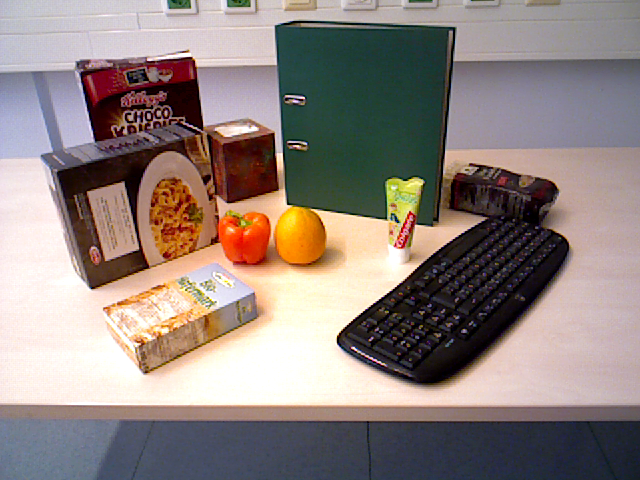
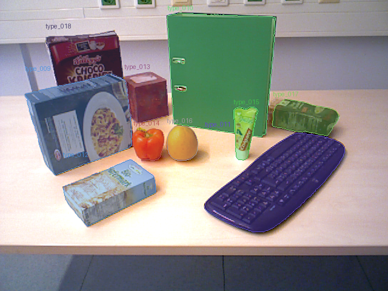
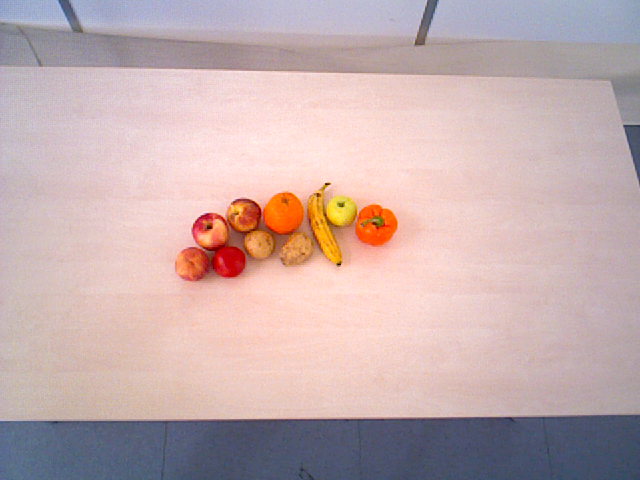
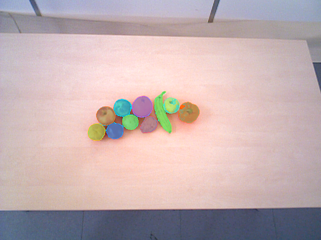

# Visual Stream Analyzer

Visual Stream Analyzer processes an ordered sequence of images and describes how visible objects change over time. It detects object candidates, builds visual representations, matches candidates between neighboring frames, groups recurring visual entities, and writes structured change events.

The repository contains the project code, tests, compact example streams, configuration files, and utilities for real-image experiments. Model weights and full external datasets are not stored in Git.

## Processing Pipeline

1. Validate the image-stream manifest and decode the frames.
2. Detect candidate objects in every frame.
3. Refine candidate masks when the real-image pipeline is used.
4. Build visual representations for the detected candidates.
5. Match candidates between neighboring frames.
6. Group recurring visual entities across the stream.
7. Create structured change events, reports, and image overlays.

The standard command-line interface keeps analysis and evaluation separate: `analyze` reads only the image stream, while `evaluate` reads annotations for an already saved run.

## Implemented Paths

- A lightweight handcrafted-feature path for local testing without model weights.
- A DINOv2 representation path with explicit local source and checkpoint paths.
- A configured real-image pipeline that combines Grounding DINO, SAM2, and DINOv2.

The real-image pipeline is executed by `tools.run_ocid_pipeline`. Its model versions, preprocessing, thresholds, matching, and grouping parameters are stored in `data/ocid/benchmark/ocid_pipeline_protocol_v1.json`.

## Repository Layout

```text
src/stream_analysis/        Python package and command-line interface
tools/                      dataset and real-image pipeline utilities
tests/                      unit and integration tests
data/streams/               compact image-stream examples
data/ocid/                  OCID provenance and local-data instructions
configs/examples/           example analysis configurations
outputs/runs/               place for selected run examples
outputs/evaluations/        place for selected evaluation artifacts
assets/visual-example/      README illustration pair
```

## Visual Examples

The examples below use selected OCID frames. The first shows the configured full pipeline output; the second focuses on candidate-mask refinement.

| Example | Input frame | Analysis result |
|---|---|---|
| Full pipeline |  |  |
| Mask refinement |  |  |

These are qualitative illustrations rather than aggregate performance measurements. Image provenance and adaptation details are recorded in `assets/visual-example/README.md`.

## Setup

Create a virtual environment and install the base dependencies:

```powershell
python -m venv .venv
.\.venv\Scripts\python.exe -m pip install -r requirements.txt
$env:PYTHONPATH = "src"
```

Install the optional CUDA/PyTorch dependencies for DINOv2:

```powershell
.\.venv\Scripts\python.exe -m pip install -r requirements-ml.txt
```

Install the additional dependencies for the Grounding DINO + SAM2 + DINOv2 path:

```powershell
.\.venv\Scripts\python.exe -m pip install -r requirements-ocid.txt
```

Model weights must be supplied as local files. The project does not download them during analysis.

## Run the Handcrafted Example

The handcrafted path runs on CPU and does not require model weights:

```powershell
$env:PYTHONPATH = "src"

.\.venv\Scripts\python.exe -B -m stream_analysis validate `
  data\streams\probe_01_stationery `
  --config configs\examples\config_handcrafted_bbox_v1.json `
  --representation-family handcrafted `
  --variant handcrafted_bbox_v1

.\.venv\Scripts\python.exe -B -m stream_analysis analyze `
  data\streams\probe_01_stationery `
  --config configs\examples\config_handcrafted_bbox_v1.json `
  --representation-family handcrafted `
  --variant handcrafted_bbox_v1 `
  --device cpu `
  --diagnostic-level standard `
  --output-root .local_outputs `
  --run-id handcrafted_example
```

The run is written to `.local_outputs/runs/handcrafted_example`.

## Run the Configured Real-Image Sample

After placing the expected local model files and prepared OCID data at the paths recorded in the protocol, validate the setup:

```powershell
$env:PYTHONPATH = "src"

.\.venv\Scripts\python.exe -B -m tools.run_ocid_pipeline check `
  --output .local_outputs\ocid_pipeline\check.json
```

Run the configured sample stream:

```powershell
.\.venv\Scripts\python.exe -B -m tools.run_ocid_pipeline analyze-sample `
  --output-root .local_outputs\ocid_pipeline\runs `
  --run-id ocid_sample
```

This path uses Grounding DINO for candidate boxes, SAM2 for masks, and DINOv2 for visual representations. Generated artifacts remain under `.local_outputs`, which is ignored by Git.

## Output Files

An analysis run contains JSON manifests, a structured stream result, a text report, runtime status, and optional overlays and diagnostics. See `outputs/README.md` for the directory structure and artifact schemas.

## Tests

Run the complete test suite from the repository root:

```powershell
$env:PYTHONPATH = "src"
.\.venv\Scripts\python.exe -B -m unittest discover -s tests
```

Tests that require local model weights or OCID files are skipped when those assets are absent.

## Dataset Attribution

Real-image utilities use the Object Clutter Indoor Dataset (OCID), distributed under CC BY 4.0. A compact attributed RGB example stream is included; the full dataset is not bundled. Source, DOI, license, and local layout are documented in `data/ocid/README.md`.
