# Visual Stream Analyzer

Visual Stream Analyzer turns an ordered sequence of RGB images from a stationary camera into structured information about visible objects and scene changes. It can serve as a perception layer for monitoring a constrained scene such as a workstation, laboratory setup, storage area, or product display. The generated results can be passed to an event log, operator interface, or external information system.

The repository contains the current implementation, tests, a compact input stream, visual results, configuration files, and utilities for running the real-image pipeline. Model weights and the full external dataset are not stored in Git.

## Key Idea

The pipeline does not require an application-specific catalogue of object classes. It uses a generic object prompt to find visible regions, creates a mask for each candidate, describes its visual appearance, and compares visible candidates across neighboring frames. This makes it possible to study a scene whose exact set of objects is not defined in advance.

The system does not assign a semantic class name to every object. Its primary output is a structured description of object candidates, masks, visual groups, and changes in the observed scene.

## Current Processing Pipeline

1. Validate the image-stream manifest and decode the ordered frames.
2. Use Grounding DINO with a generic object prompt to propose candidate regions.
3. Use evidence from neighboring frames to support candidates that may be weak in an individual frame.
4. Use SAM2 to create a pixel mask for every selected candidate.
5. Remove scene-spanning aggregate masks when the frame contains separately supported object candidates.
6. Use DINOv2 to build visual representations of the masked objects.
7. Match visible candidates between neighboring frames and group recurring visual entities.
8. Write a compact structured result, final binary masks, and type overlays.

The public command runs this complete pipeline from the first frame to the last. Its fixed profile is stored in [`configs/visual_stream_analyzer_v1.json`](configs/visual_stream_analyzer_v1.json); model selection and thresholds are therefore reproducible and are not silently chosen at run time.

## Visual Results

### Complete 11-frame stream

The repository includes one complete OCID RGB input sequence and the corresponding visualization produced by the current pipeline for every frame. All source frames are available in [`data/streams/ocid_arid10_table_top_fruits_seq10/frames`](data/streams/ocid_arid10_table_top_fruits_seq10/frames), and all result frames are available in [`assets/demo-stream/ocid_arid10_table_top_fruits_seq10/overlays`](assets/demo-stream/ocid_arid10_table_top_fruits_seq10/overlays).

| Frame | Input | Analysis result |
|---|---|---|
| 3 | 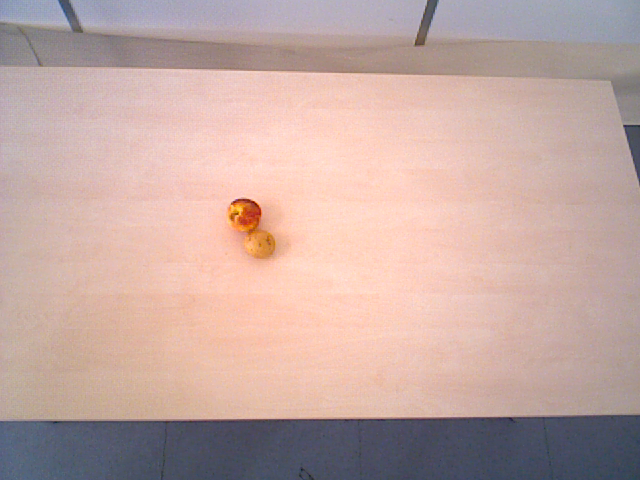 | 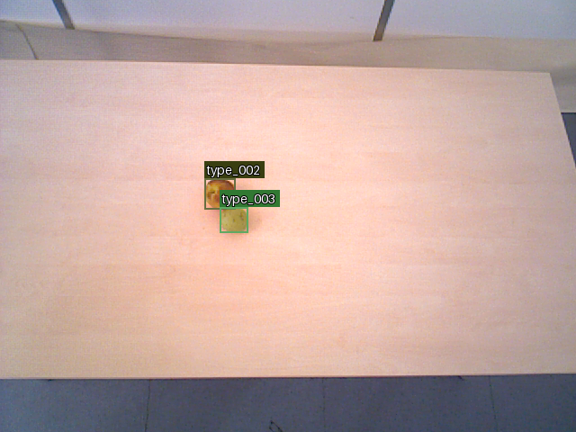 |
| 7 | 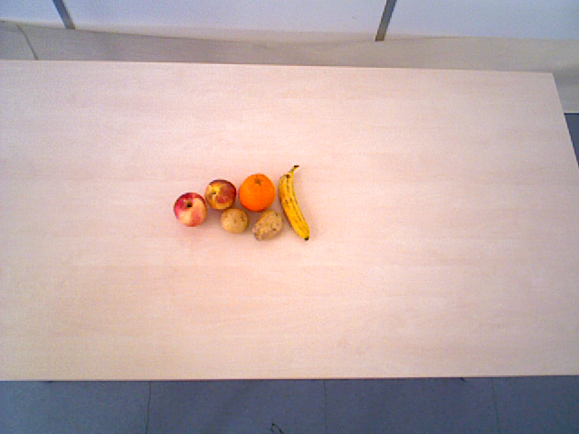 | 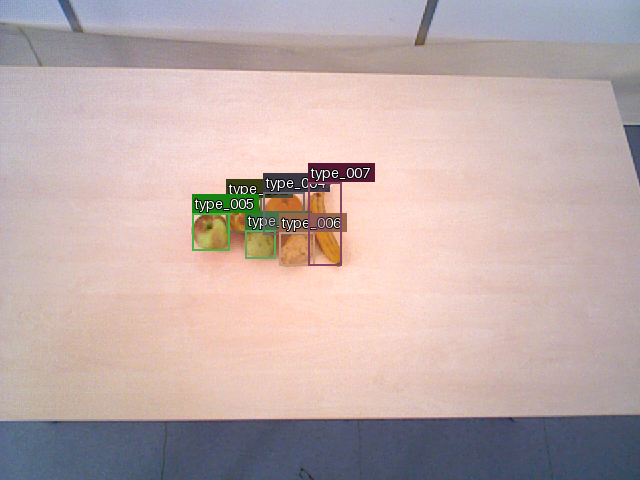 |
| 11 |  | 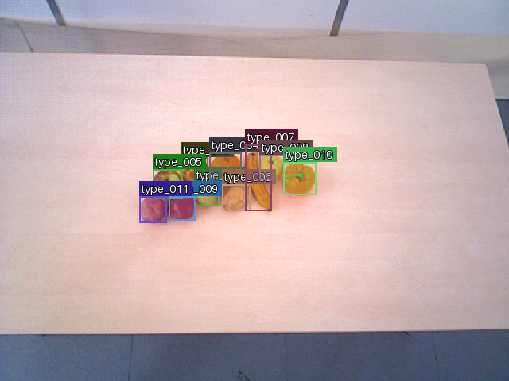 |

### Additional scenes

| OCID sequence and frame | Input | Analysis result |
|---|---|---|
| `ARID20/floor/top/seq12`, frame 15 | 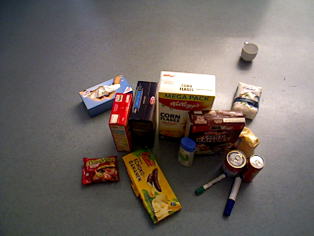 | 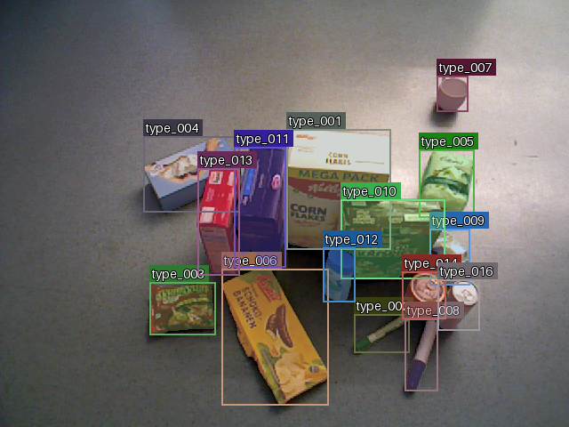 |
| `ARID20/table/bottom/seq01`, frame 13 | 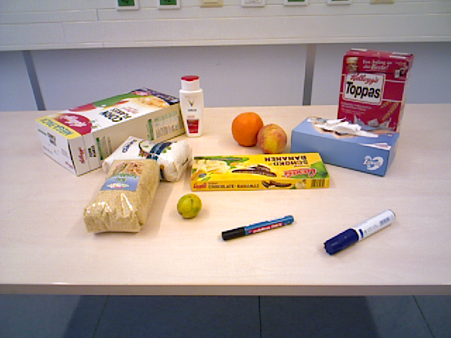 | 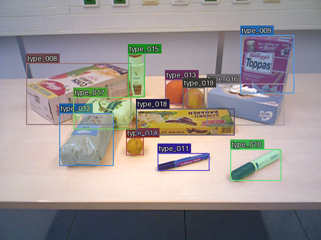 |
| `YCB10/table/top/mixed/seq21`, frame 9 | 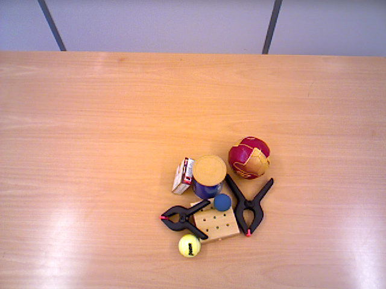 | 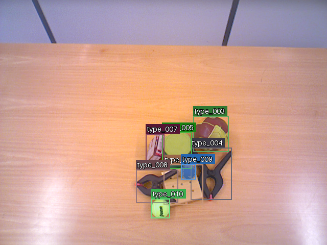 |

Each `type_...` label is a predicted visual group shared by observations that the pipeline considers visually related. It is not a semantic class name. Confidence values and internal candidate identifiers are intentionally omitted from the published overlays. Image provenance and adaptation details are recorded in [`assets/demo-stream/README.md`](assets/demo-stream/README.md) and [`assets/visual-example/README.md`](assets/visual-example/README.md).

## Quantitative Results

Performance was measured by matching predicted masks one-to-one with reference object masks in 10 annotated OCID image sequences containing 148 frames and 1,170 reference masks. A pair is considered a match when its intersection over union (IoU) reaches the selected threshold.

| Required mask IoU | Precision | Recall | F1 |
|---|---:|---:|---:|
| IoU >= 0.50 | 0.9574 | 0.8846 | 0.9196 |
| IoU >= 0.75 | 0.9001 | 0.8316 | 0.8645 |

IoU measures the overlap between a predicted mask and its reference mask. The `0.50` threshold checks substantial object coverage, while `0.75` requires closer agreement with the full reference mask. Precision describes how often a predicted mask has a valid reference match, recall describes how many reference masks are found, and F1 balances both measures.

## Repository Layout

```text
src/stream_analysis/        Python package and command-line interface
tools/                      dataset and real-image pipeline utilities
tests/                      unit and integration tests
data/streams/               compact image-stream examples
data/ocid/                  OCID provenance and local-data instructions
configs/                    fixed current runtime profile
assets/demo-stream/         complete result stream used in this README
assets/visual-example/      selected input/result pairs
outputs/                    output layout and artifact documentation
```

## Setup

Create a virtual environment and install the base dependencies:

```powershell
python -m venv .venv
.\.venv\Scripts\python.exe -m pip install -r requirements.txt
$env:PYTHONPATH = "src"
```

Install the CUDA-enabled PyTorch dependencies used by the fixed model pipeline:

```powershell
.\.venv\Scripts\python.exe -m pip install -r requirements-cuda.txt
```

Model weights must be supplied as local files. The project verifies the fixed files recorded in the runtime profile and does not download models during analysis.

## Run the Analyzer

Analyse any compatible directory that contains a `stream-input-0.1` manifest and its ordered RGB frames:

```powershell
$env:PYTHONPATH = "src"
.\.venv\Scripts\python.exe -B -m stream_analysis analyze `
  data\streams\ocid_arid10_table_top_fruits_seq10 `
  --output .local_outputs\visual-stream-result
```

By default the command reads models from the repository's `models` directory. A different local root can be supplied explicitly:

```powershell
.\.venv\Scripts\python.exe -B -m stream_analysis analyze `
  <stream-directory> `
  --output <output-directory> `
  --models-root <models-directory>
```

The output directory must not already exist. The command validates the manifest, local model files, and CUDA availability before decoding the RGB frames.

## Output Files

An analysis produces exactly three top-level entries:

```text
<output-directory>/
  result.json
  masks/<frame_id>/P00.png
  overlays/<frame_id>.png
```

`result.json` contains the ordered frames, frame-local objects, predicted visual groups, neighboring-frame matches, and scene-change events. Every `Pnn.png` is a full-frame binary mask; `Pnn` is local to one frame. Overlays are generated from those same masks and display only the corresponding `type_...` labels. See [`outputs/README.md`](outputs/README.md) for the complete output contract and [`assets/demo-stream/ocid_arid10_table_top_fruits_seq10`](assets/demo-stream/ocid_arid10_table_top_fruits_seq10) for a checked-in full result.

## Tests

Run the complete test suite from the repository root:

```powershell
$env:PYTHONPATH = "src"
.\.venv\Scripts\python.exe -B -m unittest discover -s tests
```

Tests that require local model weights or OCID files are skipped when those assets are absent.

## Dataset Attribution

Real-image utilities use the Object Clutter Indoor Dataset (OCID), distributed under CC BY 4.0. A compact attributed RGB example stream and selected adapted result images are included; the full dataset is not bundled. Source, DOI, license, and local layout are documented in [`data/ocid/README.md`](data/ocid/README.md).
